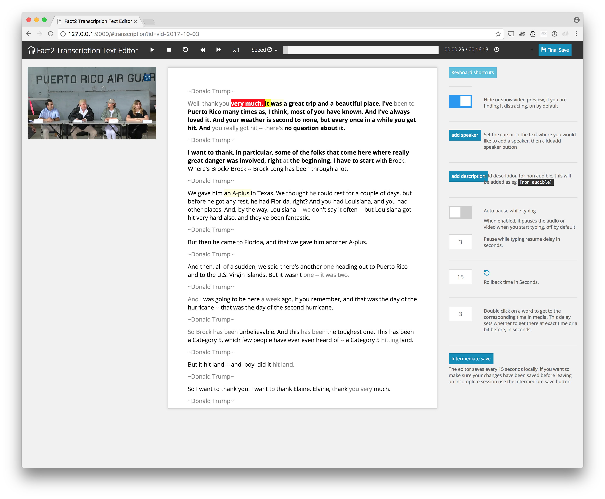
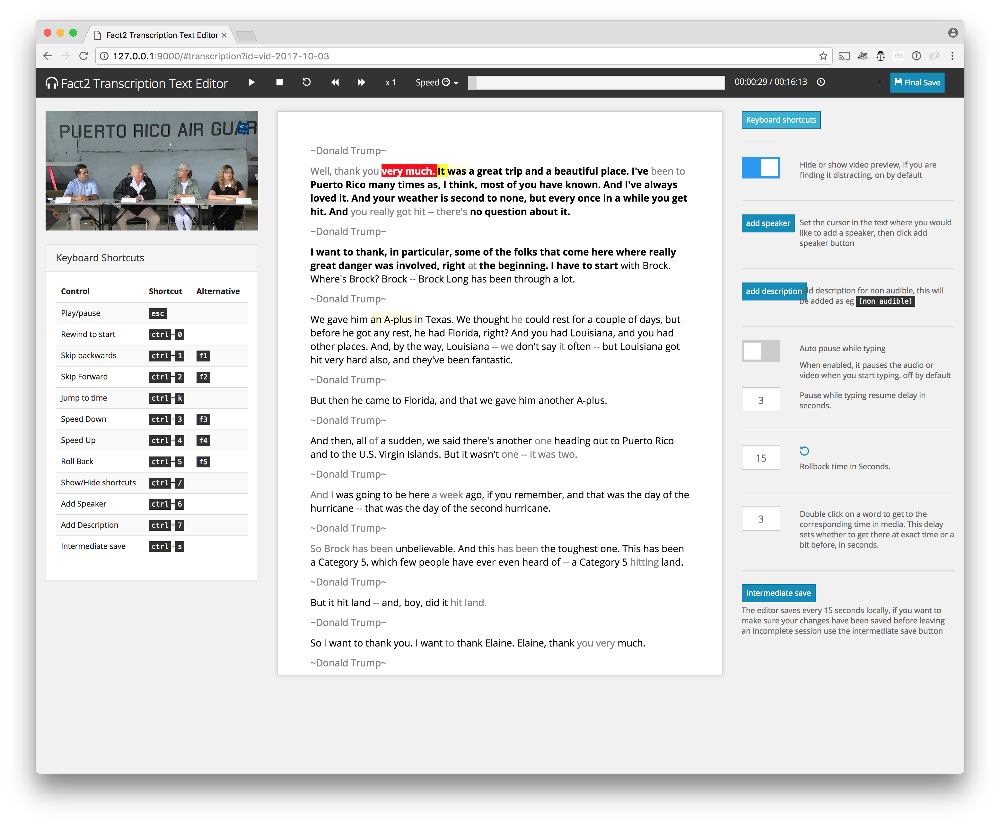
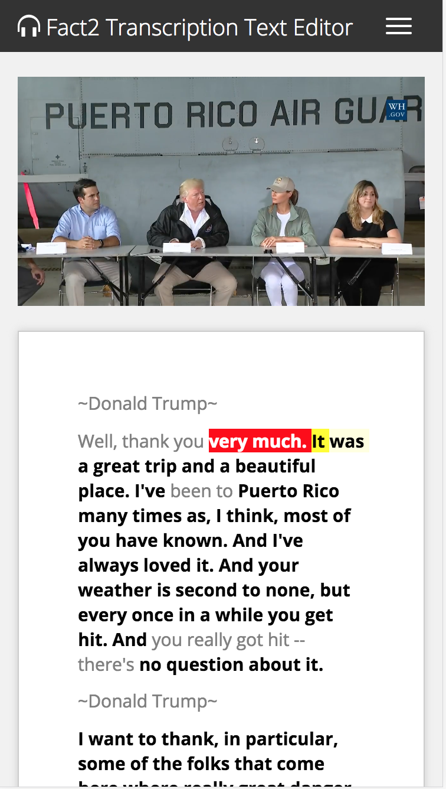
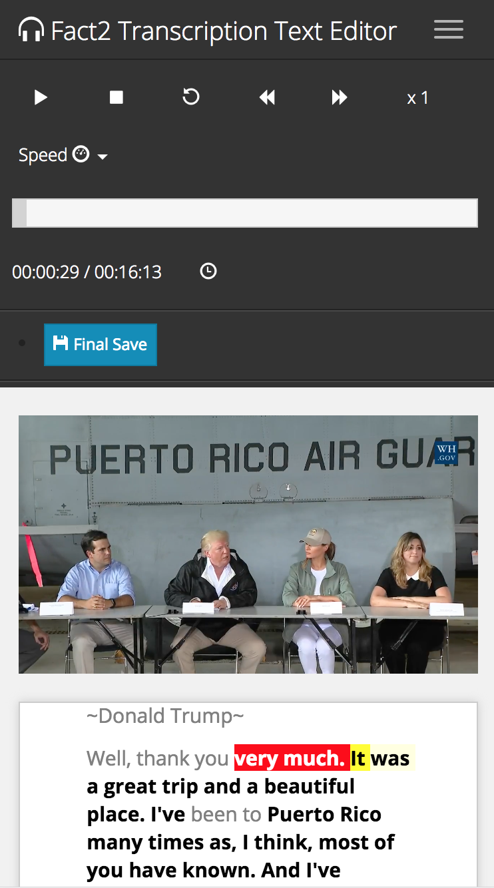

# Fact2 Transcriptions Text Editor

Largely inspired by [oTranscribe](http://otranscribe.com/) a client side transcriptions text editor to proofread and correct the text before re-alignement back on the server.

## Documentation 

Basic info to get up and running in this `README`, for more info  and documentation on 

- [stack](./notes/stack.md), 
- [folder structure](./notes/folder_structure_explained.md) 
- [features](./notes/features.md) 
- [develompment preview on mobile ](./notes/dev_test_on_mobile.md)
- [Changing bootswatch theme](./notes/changing_bootswatch_theme.md)
- [Changing Confidence Score Variables](./notes/changing_confidence_score_variables.md)
- [Changing save to server interval](./notes/changing_save_to_server_interval.md)
- [Changing save client locally interval](./notes/change_saved_locally_interval.md)
- [Integration](./notes/integration.md)
- [design/architecture](./notes/design_architecture.md)
- etc..

See the [`notes`](./notes) folder in this repo.


## Transcriptions Text editor 



## Shortcuts 



## Mobile responsive 

See mobile responsive screenshots  [here](screenshots/Fact2_transcription_text_editor_mobile.png) and [here](screenshots/Fact2_transcription_text_editor_mobile_controls.png)

<!-- 

 -->


## Usage

### Local setup 

using the terminal navigate to the folder where you'd like to add the project, and clone this repo as follow

```bash
git clone git@github.com:frisch1/transcription_editor_factbase.git
```

get into the folder

```bash
cd transcription_editor_factbase
```

install dependencies 

```bash
npm install
```

## Local dev enviroment

at the root of of the project, do 

```bash
npm start
```

This runs webpack [`webpack-dev-server`](https://github.com/webpack/webpack-dev-server) from the `src` folder. However doesn't build a local copy for deployment, will see that in the next section.

Then Open following page in your prefered browser.

[http://0.0.0.0:9000/#transcription?id=vid-2017-10-03](http://127.0.0.1:9000/#transcription?id=vid-2017-10-03)

Change the id query field in the url accordingly to load different transcripts.


### Build & deployment

After having followed the previous instructions for local setup. do the following

```bash
npm run build
```

This builds app is in `/dist` folder. 


For how to integrate with the wider system/setup see section on [integration](./notes/integration.md)


## Test coverage

Very light automated test coverage of some of the module in `lib` using [jest](https://facebook.github.io/jest/);


<!-- ### version control 

Origin is bitbucket repo  used for development

to push to private github 

```
git push githubfactbase master
```

https://help.github.com/articles/adding-a-remote/ -->


## Contributors

- [Pietro](https://github.com/pietrop)